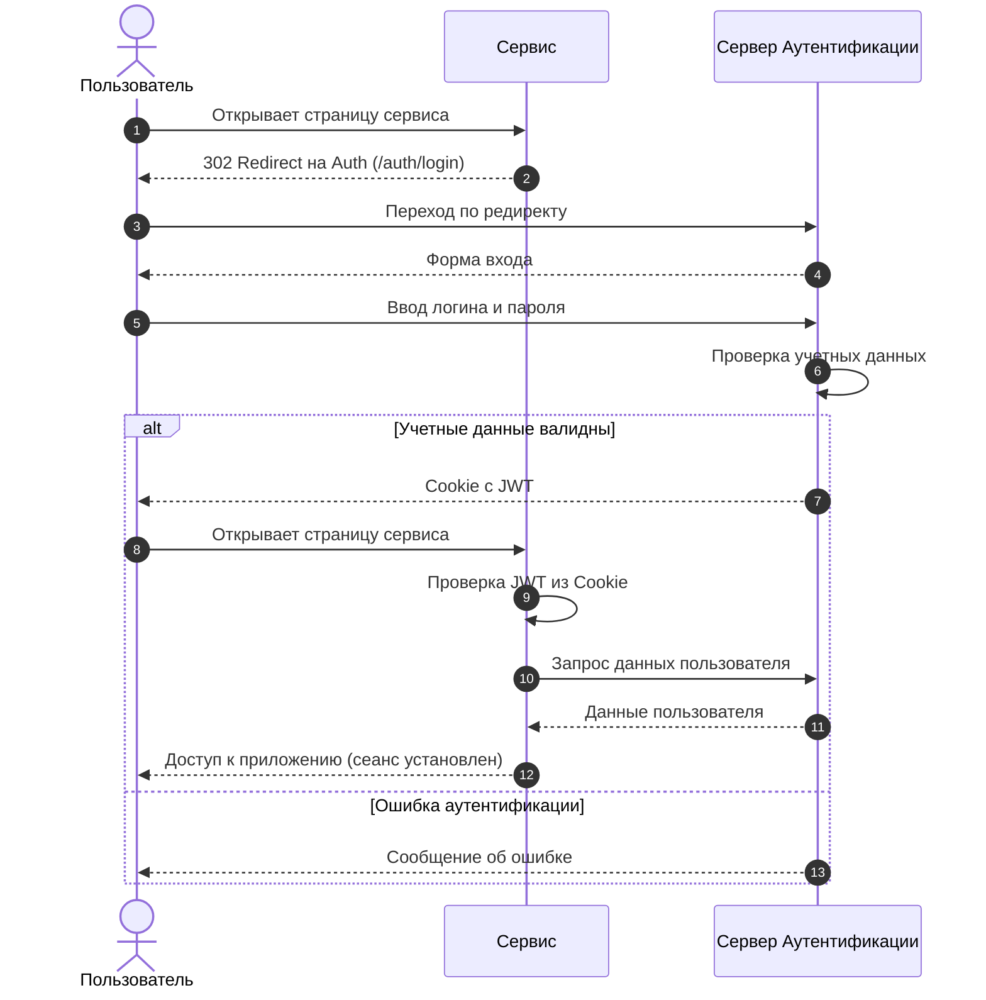

# Знакомство

Добро пожаловать, это сервис Аутентификации! 

Здесь вы найдете подробные инструкции и информацию о том, как настроить, запустить и использовать сервер аутентификации в сервисах ОблакоТех.

## Как это работает
Любой сервис ОблакоТех может использовать сервер аутентификации для проверки подлинности пользователей. 

Когда пользователь пытается войти в сервис, сервис перенаправляет его на сервер аутентификации. 
Там пользователь вводит свои учетные данные, и сервер аутентификации проверяет их. 
Если учетные данные верны, сервер аутентификации перенаправляет пользователя обратно в сервис с подтверждением успешной 
аутентификации.



### Аутентификация Web UI
Для аутентификации через веб-интерфейс, сервисы перенаправляют пользователей на страницу входа сервера аутентификации.

Страница входа доступна по пути `/auth/login`.  
После входа пользователь перенаправляется на страницу личного кабинета по пути `/auth/account`.

### Аутентификация API
Для аутентификации через API, сервисы используют JWT токены.

Для получения токена, сервисы отправляют запрос на `/api/auth/v1/login` с учетными данными пользователя.
```js
{
  "username": "user-1@email.io",
  "password": "P@ssw0rd123"
}
```

В ответ сервис получает JWT токен, который используется для аутентификации в последующих запросах.
```js
{
  "expires_in": 43200,
  "token_type": "Bearer",
  "token": "eyJhbG...HGSA",
  "isSuccess": true,
  "message": [],
  "traceId": "69TEOM4U"
}
```
Полное описание API доступно по запросу `/swagger` или в документации сервиса.
