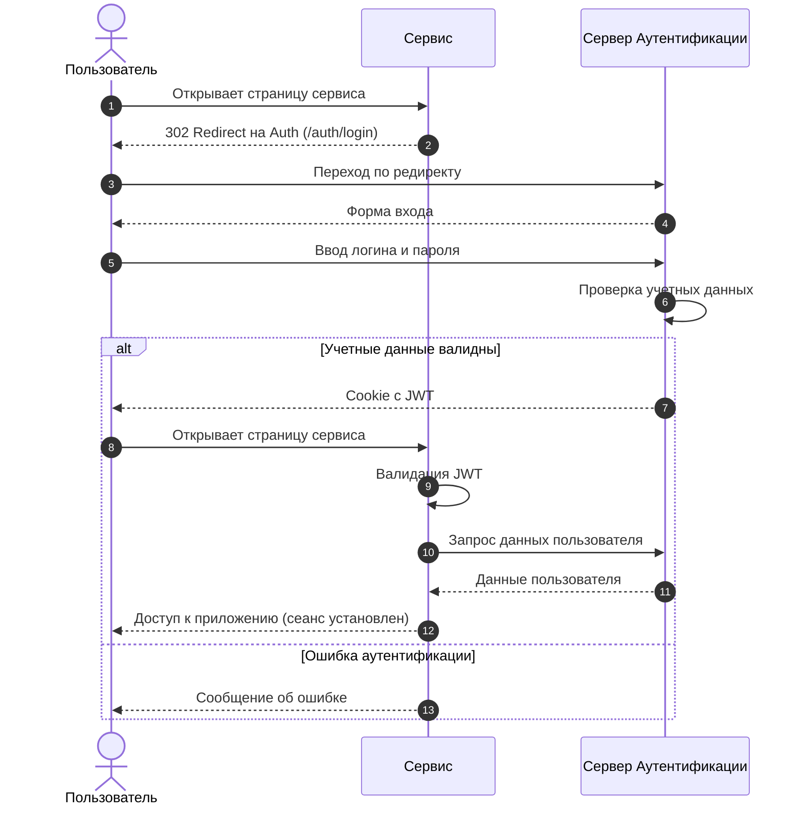

# Главная

Сервис аутентификации обеспечивает единую точку входа для сервисов Облакотех.

## Как это работает

Любой сервис Облакотех может использовать сервер аутентификации для проверки подлинности пользователей.  

Когда пользователь пытается войти в сервис, сервис перенаправляет его на сервер аутентификации. Там пользователь вводит свои учетные данные (логин и пароль).  
Если учетные данные верны, сервер аутентификации выдаёт пользователю токен, с которым можно получить доступ к сервису.



### Аутентификация Web UI

Для аутентификации через веб-интерфейс, сервисы перенаправляют пользователей на страницу входа сервера аутентификации.

Страница входа доступна по пути `/auth/login`.  
После входа пользователь перенаправляется на страницу личного кабинета по пути `/auth/account`.

Подробное описание в [руководстве пользователя](./manual.md).

### Аутентификация API

Для аутентификации через API, сервисы используют JWT токены.

Для получения токена, сервисы отправляют запрос на `/api/auth/v1/login` с учетными данными пользователя.

```js
{
  "username": "user-1@email.io",
  "password": "P@ssw0rd123"
}
```

В ответ сервис получает JWT токен, который используется для аутентификации в последующих запросах.

```js
{
  "expires_in": 43200,
  "token_type": "Bearer",
  "token": "eyJhbG...HGSA",
  "isSuccess": true,
  "message": [],
  "traceId": "69TEOM4U"
}
```

Полное описание API доступно по запросу `/swagger` или в документации сервиса.
