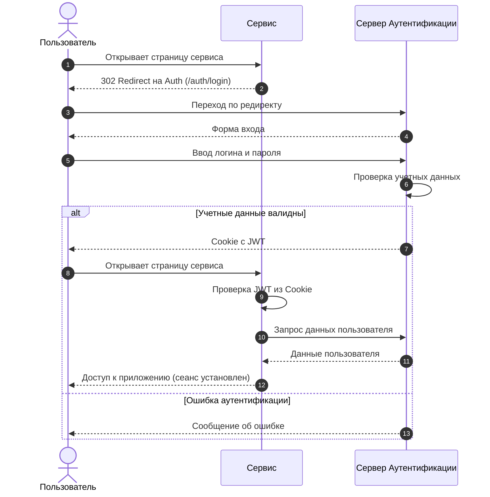

# Знакомство

Добро пожаловать в раздел документации по аутентификации! 

Здесь вы найдете подробные инструкции и информацию о том, как настроить, запустить и использовать сервер аутентификации в сервисах ОблакоТех.

## Как это работает
Любой сервис ОблакоТех может использовать сервер аутентификации для проверки подлинности пользователей. 

Когда пользователь пытается войти в сервис, сервис перенаправляет его на сервер аутентификации. 
Там пользователь вводит свои учетные данные, и сервер аутентификации проверяет их. 
Если учетные данные верны, сервер аутентификации перенаправляет пользователя обратно в сервис с подтверждением успешной 
аутентификации.

## Как настроить