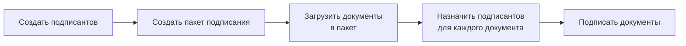

# Редактирование файла подписи

### Редактирование файла подписи
!!! info
Редактирование электронной подписи доступно только зарегистрированным пользователям

### Работа с сервисом
Сервис подписания документов включает следующие компоненты:

- Подписант: контактная информация человека, который подписывает документ  
- Пакет документов: набор документов, подписываемых одним или несколькими подписантами. Каждый пакет имеет номер, комментарий, отдельную ссылку и историю. 
- Документ: файл, который будет подписан  

### Создание подписантов
Для создания подписанта в разделе навигации (слева) выберите "Подписанты".  
В этом разделе отображается список всех подписантов и можно добавить нового подписанта.

<figure markdown="span">
  { width="500" }
  <figcaption>Список подписантов</figcaption>
</figure>

Для создания подписанта нажмите кнопку =="Новый"==.  
При создании подписанта укажите его ФИО, электронную почту, контактный телефон и СНИЛС. ==Все поля опциональны==.

- Поле **ФИО** и **Электронная почта** используется для идентификации подписанта в списке.
- Поле **Телефон** используется для отправки документов в мобильное приложение. Используется только при подключенной интеграции с провайдером мобильной подписи (Sign.me, MyDSS).
- Поле **СНИЛС** используется для отправки документов в Госключ.

Если, какой то из способов подписания не используется, то соответствующее поле можно оставить пустым.