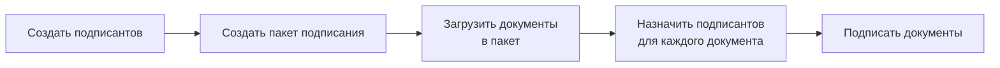
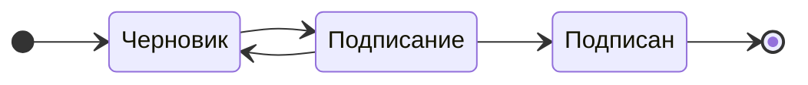

# Подписание документов

### Редактирование файла подписи
!!! info
    Редактирование электронной подписи доступно только зарегистрированным пользователям

### Работа с сервисом
Сервис подписания документов включает следующие компоненты:

- Подписант: контактная информация человека, который подписывает документ  
- Пакет документов: набор документов, подписываемых одним или несколькими подписантами. Каждый пакет имеет номер, комментарий, отдельную ссылку и историю. 
- Документ: файл, который будет подписан  

Все пакеты подписания отображаются в разделе "Подписание".  
Каждый пакет имеет номер, комментарий, ссылку на документы и историю.

<figure markdown="span">
  { width="500" }
  <figcaption>Список пакетов подписания</figcaption>
</figure>

Для работы с пакетом нажмите на карточку пакета.
 
### Создание подписантов
Для создания подписанта в разделе навигации (слева) выберите "Подписанты".  
В этом разделе отображается список всех подписантов и можно добавить нового подписанта.

<figure markdown="span">
  { width="500" }
  <figcaption>Список подписантов</figcaption>
</figure>

Для создания подписанта нажмите кнопку =="Новый"==.  
При создании подписанта укажите его ФИО, электронную почту, контактный телефон и СНИЛС. ==Все поля опциональны==.

- Поле **ФИО** и **Электронная почта** используется для идентификации подписанта в списке.
- Поле **Телефон** используется для отправки документов в мобильное приложение. Используется только при подключенной интеграции с провайдером мобильной подписи (Sign.me, MyDSS).
- Поле **СНИЛС** используется для отправки документов в Госключ.

Если, какой то из способов подписания не используется, то соответствующее поле можно оставить пустым.

<figure markdown="span">
  { width="500" }
  <figcaption>Создание подписанта</figcaption>
</figure>

### Создание пакета подписания
Для создания нового пакета подписания на странице "Подписание" нажмите кнопку =="Новый"==.  
Заполните поле "Комментарий" и добавьте файлы, которые будут подписаны.

<figure markdown="span">
  { width="500" }
  <figcaption>Создание пакета подписания</figcaption>
</figure>

Для каждого добавленного документа назначьте одного или нескольких подписантов. Нажмите кнопку =="Подписант"== в карточке документа, ==выберите подписантов== из списка, а затем нажмите кнопку =="Добавить"==.

### Подписание документов
Для подписания нажмите кнопку =="К подписанию"== в разделе Управление.  

### Статусы пакетов подписания
Пакеты подписания могут иметь следующие статусы:

- **Черновик** - пакет создан, но не отправлен на подписание. Можно добавлять и удалять документы
- **Подписание** - пакет отправлен на подписание. Подписанты могут подписывать документы, возможно сформировать ссылку для подписи
- **Подписан** - все документы в пакете подписаны

Для статуса "Подписание" возможно возращение в статус "Черновик" для добавления новых документов или подписантов