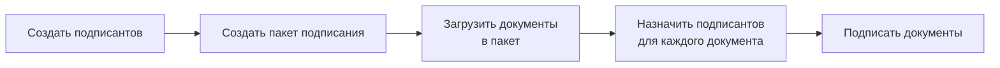
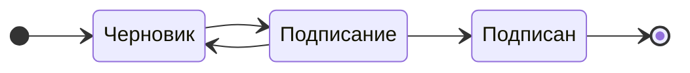

# Подписание документов

!!! info
    Подписание документов доступно только зарегистрированным пользователям.

## Работа с сервисом

Сервис подписания документов включает следующие компоненты:

- Подписант: контактная информация человека, который подписывает документ
- Пакет документов: набор документов, подписываемых одним или несколькими подписантами. Каждый пакет имеет номер, комментарий, отдельную ссылку и историю.
- Документ: файл, который будет подписан

Все пакеты подписания отображаются в разделе "Подписание".
Каждый пакет имеет номер, комментарий, ссылку на документы и историю.

<figure markdown="span">
  { width="500" }
  <figcaption>Список пакетов подписания</figcaption>
</figure>

Для работы с пакетом нажмите на карточку пакета.

## Создание подписантов

Для создания подписанта в разделе навигации (слева) выберите "Подписанты".
В этом разделе отображается список всех подписантов и можно добавить нового подписанта.

<figure markdown="span">
  { width="500" }
  <figcaption>Список подписантов</figcaption>
</figure>

Для создания подписанта нажмите кнопку =="Новый"==.
При создании подписанта укажите его ФИО, электронную почту, контактный телефон и СНИЛС. ==Все поля опциональны==.

- Поля **ФИО** и **Электронная почта** используются для идентификации подписанта в списке.
- Поле **Телефон** используется для отправки документов в мобильное приложение. Используется только при подключённой интеграции с провайдером мобильной подписи (Sign.me, MyDSS).
- Поле **СНИЛС** используется для отправки документов в Госключ.

Если какой-то из способов подписания не используется, соответствующее поле можно оставить пустым.

<figure markdown="span">
  { width="500" }
  <figcaption>Создание подписанта</figcaption>
</figure>

## Создание пакета подписания

Для создания нового пакета подписания на странице "Подписание" нажмите кнопку =="Новый"==.
Заполните поле "Комментарий" и добавьте файлы, которые будут подписаны.

<figure markdown="span">
  { width="500" }
  <figcaption>Создание пакета подписания</figcaption>
</figure>

Для каждого добавленного документа назначьте одного или нескольких подписантов. Нажмите кнопку =="Подписант"== в карточке документа, ==выберите подписантов== из списка, а затем нажмите кнопку =="Добавить"==.

## Статусы пакетов подписания

Пакеты подписания могут иметь следующие статусы:

- **Черновик** — пакет создан, но не отправлен на подписание. Можно добавлять и удалять документы.
- **Подписание** — пакет отправлен на подписание. Подписанты могут подписывать документы, возможно сформировать ссылку для подписи.
- **Подписан** — все документы в пакете подписаны.

Добавить файлы или подписантов в пакет можно только в статусе "Черновик".

Из статуса "Подписание" возможно возвращение в статус "Черновик" для добавления новых документов или подписантов.

## Добавление файлов в пакет подписания

Для добавления файлов в пакет подписания нажмите кнопку =="Добавить файл"== в карточке пакета. Можно загрузить несколько файлов одновременно.
Каждому загруженному файлу необходимо назначить одного или нескольких подписантов.

После перевода пакета в статус "Подписание" добавление файлов будет недоступно.

## Подписание документов подписантом

После перевода пакета в статус "Подписание" подписанты могут подписать документы.
Для ==каждого подписанта== будет отображаться ==раздел с документами== для подписи.

Каждый документ можно ==скачать== и ==добавить подпись==. Возможность скачивания позволяет ознакомиться с
документом перед подписанием (требование ФЗ-63). Добавление подписи пригодится, если подписант оформил
её через другие сервисы или получил, например, у нотариуса.

<figure markdown="span">
  { width="500" }
  <figcaption>Раздел подписанта</figcaption>
</figure>

Для подписания нажмите кнопку =="Подписать"== и выберите способ подписания.

После того как все подписанты подпишут документы, пакет автоматически перейдёт в статус "Подписан".
Чтобы выгрузить данные с подписями, нажмите кнопку "Выгрузить".

## Способы подписания

### Локальная подпись

Локальная подпись — это подписание документа с использованием сертификата, установленного на компьютере пользователя.
Страница сервиса отправляет запрос на подписание документа в браузер пользователя, и пользователь подтверждает подписание.
Этот метод подходит для организаций, где у сотрудников есть электронные подписи, установленные на компьютерах.

!!! note "Требуется настройка компьютера пользователя"
    Для использования сервиса на вашем компьютере должно быть установлено программное обеспечение для работы с электронной подписью и сертификаты ключей.
    Подробнее о настройке компьютера вы можете узнать в разделе [Настройка компьютера](https://rulink.io/support/crypto/setup).

### Подпись по ссылке

Подпись по ссылке позволяет подписывать документы удалённо.
Пользователь сервиса формирует ссылку и отправляет её подписанту на электронную почту.
Подписанту не нужно вводить логин и пароль — достаточно перейти по полученной ссылке и подписать документы.

Этот метод идеально подходит для подписания документов с партнёрами или клиентами, которые не зарегистрированы в сервисе.

!!! note "Требуется настройка компьютера пользователя (партнёра)"
    Для использования сервиса на вашем компьютере должно быть установлено программное обеспечение для работы с электронной подписью и сертификаты ключей.
    Подробнее о настройке компьютера вы можете узнать в разделе [Настройка компьютера](https://rulink.io/support/crypto/setup).

### Серверная подпись

Серверная подпись позволяет подписывать документы с использованием сертификата, установленного на сервере сервиса.
Нажмите кнопку "Подписать", и документ будет автоматически подписан сервером.
Дополнительные настройки не требуются, так как подписание происходит непосредственно на сервере.
Рекомендуется использовать через API.

Этот метод подходит для задач, требующих автоматизации процесса подписания, например для автоматического подписания запросов в финансовых системах.

!!! note "Требуется настройка сервера"
    Для использования серверной подписи необходимо установить сертификат ключа на сервере.
    Описание установки в разделе [Настройка сервера](https://rulink.io/support/crypto/setup).

### Госключ

Госключ — это сервис, который позволяет подписывать документы с использованием электронной подписи Государственной информационной системы «Госуслуги».
Каждый пользователь сервиса может подписать документы с использованием своего аккаунта Госуслуг и мобильного приложения.
Полное описание процесса подписания через Госключ доступно на сайте [goskey.ru](https://goskey.ru/).

!!! note "Интеграция с Госключ"
    Для возможности отправлять документы на подписание через Госключ необходимо выполнить интеграцию с Минцифры.
    Подробнее об интеграции с Минцифры по [запросу](mailto:hello@rulink.io).

### Мобильная подпись

Мобильная подпись позволяет подписывать документы с использованием мобильного устройства.

!!! note "Интеграция с мобильной подписью"
    Для работы с мобильной подписью необходимо заключить договор с одним из провайдеров мобильной подписи (Sign.me, MyDSS).
    Подробнее об интеграции с провайдерами мобильной подписи по [запросу](mailto:hello@rulink.io).
