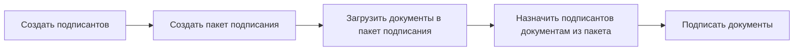

# Редактирование файла подписи

### Редактирование файла подписи
!!! info
Редактирование электронной подписи доступно только зарегистрированным пользователям

### Подписание документов
Сервис подписания документов включает следующие компоненты:
- Подписант: контактная информация человека, который подписывает документ
- Пакет документов: набор документов, подписываемых одним или несколькими подписантами
- Документ: файл, который будет подписан

