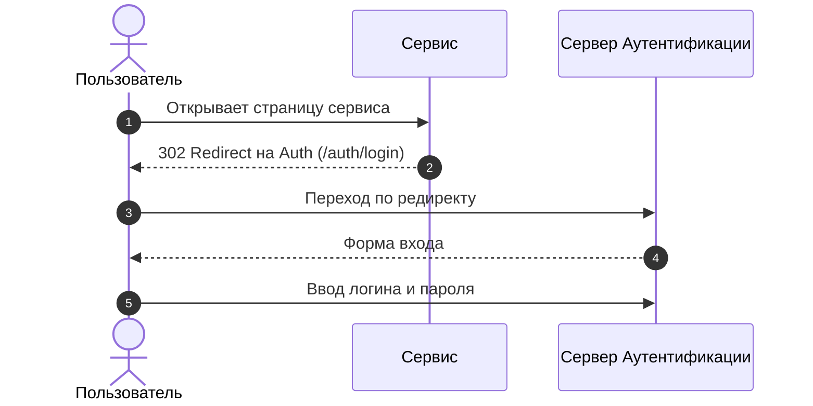

# Примеры разметки 

Полное описание синтаксиса разметки можно найти в [https://www.mkdocs.org/user-guide/](https://www.mkdocs.org/user-guide/).

## Заголовки
# Заголовок1
## Заголовок2
### Заголовок3
#### Заголовок4
##### Заголовок5
###### Заголовок6
Обычный текст

## Абзацы
Абзацы разделяются пустой строкой.

Это второй абзац.  
Предложение с новой строки (два пробелы в конце строки).
Это третий абзац.

## Списки
### Маркированный список
Обычный текст перед списком.

- Пункт 1
- Пункт 2
    - Подпункт 2.1
    - Подпункт 2.2
        - Подпункт 2.2.1
    
Обычный текст после списка.

### Нумерованный список
Обычный текст перед списком.

1. Пункт 1
2. Пункт 2
    1. Подпункт 2.1
    2. Подпункт 2.2
       1. Подпункт 2.2.1
       2. Подпункт 2.2.2
      
Обычный текст после списка.

## Ссылки
### Внешние ссылки
[Текст ссылки](https://example.com)
### Внутренние ссылки
[Текст ссылки](index.md)
### Ссылки на email
[email](mailto:test@rulink.io)

## PlantUML
Для вставки диаграмм PlantUML используйте следующий синтаксис:

## Блоки примечаний
!!! note "Заголовок примечания"
    Текст примечания.

??? note "Расхлопушка примечания"
    Текст примечания.