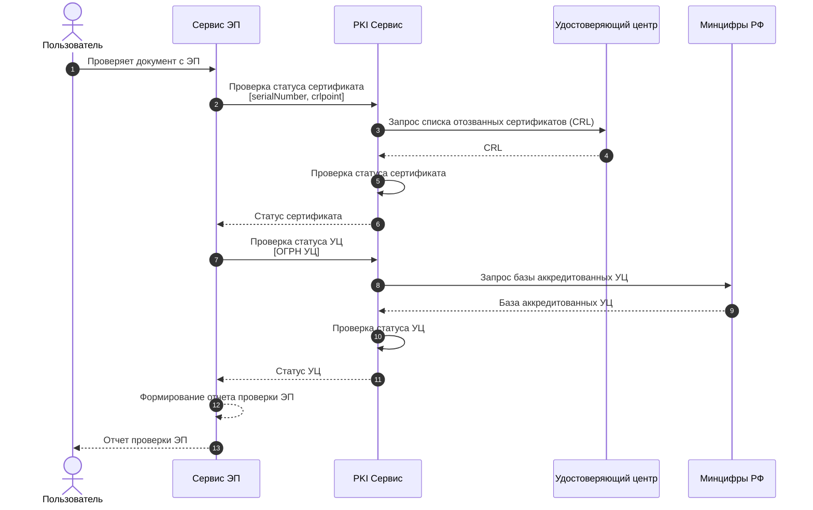

# Главная

Добро пожаловать, это страница поддержки сервиса информации о сертификатах (PKI).  
Здесь подробные инструкции как использовать сервер PKI.

## Как это работает
Одним из этапов работы с электронными подписями (ЭП) является проверка актуальности сертификата электронной подписи и удостоверяющего центра. 

Сертификат электронной подписи может быть отозван до окончания срока действия. 

Удостоверяющий центр, выдавший сертификат, может быть аккредитованный или неаккредитованный.  
**КЭП** может быть выпущена только аккредитованным удостоверяющим центром.  
**НЭП** может быть выпущена как аккредитованным, так и не аккредитованным удостоверяющим центром.  

Сервер PKI предоставляет API для проверки статуса сертификатов и удостоверяющих центров.

### Схема работы

Сервис PKI является служебным сервисом Сервиса работы с электронной подписью.  
PKI сервис доступен только по API.

Если вы установили Сервис работы с электронной подписью, то PKI сервис уже настроен и готов к использованию.

API документация доступна по адресу:  
`https://<your-domain>/api/pki/v1/swagger`